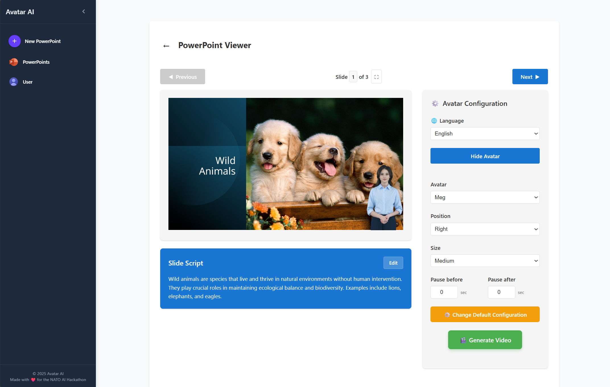
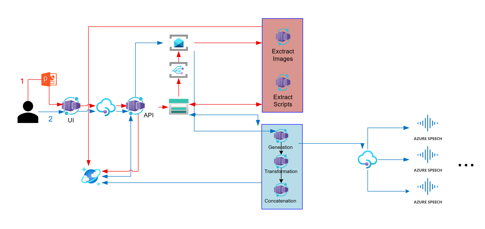

# PowerPoint Avatar Video Generator

A cloud-native application that transforms PowerPoint presentations into engaging video content with AI-powered avatars. Users authenticate with Microsoft Entra ID, upload PowerPoint files, customize avatar settings (type, position, size, and breaks), and generate videos where avatars read the slide notes with the original presentation slides as backgrounds.



## Features

- **Microsoft Entra ID Authentication**: Secure user authentication
- **PowerPoint Processing**: Automatic extraction of slides and speaker notes
- **Avatar Customization**: Configure avatar type, position, size, and speaking breaks
- **Video Generation**: AI-powered text-to-speech with Azure Speech Services
- **Real-time Updates**: WebSocket-based status updates during processing
- **Scalable Architecture**: Microservices-based design with Azure Container Apps

## Quick Start


### Prerequisites:

1. Install [Azure Developer CLI](https://learn.microsoft.com/en-us/azure/developer/azure-developer-cli/install-azd?tabs=winget-windows%2Cbrew-mac%2Cscript-linux&pivots=os-windows).
2. Ensure you have access to an Azure subscription
3. Docker - Follow the [official Docker installation instructions](https://docs.docker.com/get-started/get-docker/) - make sure your docker is loged in (docker login -u "username" -p "password"
 )
4. Python version >= 3.10, < 3.13

### Step by step deployment
   
#### 1. Clone the repository     
```bash  
git clone https://github.com/beluxappdev/avatar-tts-ppt-presentation
```
#### 2. Login to your Azure account
```bash
azd auth login
```
> You need to choose your preferred region (you can start with east us or sweden central or any other available region)

#### 3. Deploy Azure Resources and the app

```bash
azd up
```

### Local Development

For local development and testing:

```bash
# Copy environment template
cp env_template .env

# Configure your .env file with required settings

# Start all services locally
docker-compose up --build
```

## Architecture



The application follows a microservices architecture with two main workflows:

### Flow 1: PowerPoint Upload and Processing

1. **Upload**: User uploads PowerPoint through the web interface
2. **API Processing**: Request goes through Azure API Management to the main API
3. **Storage**: API creates entry in Cosmos DB with initial status and saves PowerPoint to Azure Storage Account
4. **Message Queue**: Storage trigger sends message to Service Bus topic containing the PowerPoint URL
5. **Parallel Processing**: Service Bus topic has two subscriptions processed by separate containers:
   - **Image Extractor**: Fetches PowerPoint, extracts slide images, stores them in Storage Account
   - **Script Extractor**: Fetches PowerPoint, extracts speaker notes and text, stores them in Storage Account
6. **Status Updates**: Both containers update Cosmos DB status; API notifies UI via WebSocket when all slides are processed
7. **Customization View**: UI updates to show all slides and allow user to customize video settings

### Flow 2: Video Generation

1. **Generation Request**: User clicks "Generate Video" with specific avatar configuration
2. **API Processing**: Request goes through API Management; API creates new video entry in Cosmos DB
3. **Queue Processing**: API sends message to Service Bus queue with user configuration
4. **Video Pipeline**: Three-stage processing with separate containers:
   - **Video Generator**: Receives message, calls Azure Text-to-Speech Avatar API to generate avatar videos
   - **Video Transformation**: Receives video link, overlays avatar on slide backgrounds with user configuration, saves individual videos, updates Cosmos DB
   - **Video Concatenator**: When all slides are transformed, downloads individual videos, concatenates them in correct order, saves final video
5. **Completion**: API notifies UI via WebSocket when final video is ready; UI updates to show generated video

## Technology Stack

### Frontend
- **React 18** with TypeScript
- **Vite** for fast development and building
- **Microsoft Authentication Library (MSAL)** for Entra ID integration

### Backend Services
- **Python** microservices architecture
- **FastAPI** for REST API endpoints
- **WebSocket** for real-time status updates
- **Shared common module** across all services

### Azure Services
- **Container Apps**: Hosting microservices
- **API Management**: API gateway and security
- **Cosmos DB**: Document database for metadata
- **Storage Account**: Blob storage for files and videos
- **Service Bus**: Message queuing for async processing
- **Speech Services**: Text-to-speech with avatar generation
- **Container Registry**: Docker image hosting
- **Application Insights**: Monitoring and logging

## Project Structure

```
avatar-tts-ppt-presentation/
├── src/
│   ├── frontend/                 # React + TypeScript + Vite web application
│   │   ├── src/                  # Frontend source code
│   │   ├── public/               # Static assets
│   │   └── Dockerfile            # Frontend container configuration
│   └── backend/                  # Microservices backend
│       ├── api/                  # Main API service
│       ├── image-extractor/      # PowerPoint image extraction service
│       ├── script-extractor/     # PowerPoint text/notes extraction service
│       ├── video-generator/      # Avatar video generation service
│       ├── video-transformation/ # Avatar overlay and positioning service
│       ├── video-concatenator/   # Video combining service
│       └── common/               # Shared utilities and models
├── infra/                        # Infrastructure as Code (Bicep)
│   ├── main.bicep               # Main infrastructure definition
│   ├── main.parameters.json     # Deployment parameters
│   └── modules/                 # Modular infrastructure components
│       ├── api-management/      # Azure API Management
│       ├── container-apps/      # Azure Container Apps
│       ├── container-registry/  # Azure Container Registry
│       ├── cosmos/              # Cosmos DB
│       ├── identity/            # Managed Identity
│       ├── monitoring/          # Application Insights
│       ├── service-bus/         # Service Bus queues and topics
│       ├── speech-services/     # Azure Speech Services
│       └── storage-account/     # Blob Storage
├── azure.yaml                   # Azure Developer CLI configuration
└── docker-compose.yml          # Local development setup
```

## License

This project is licensed under the MIT License - see the LICENSE file for details.
